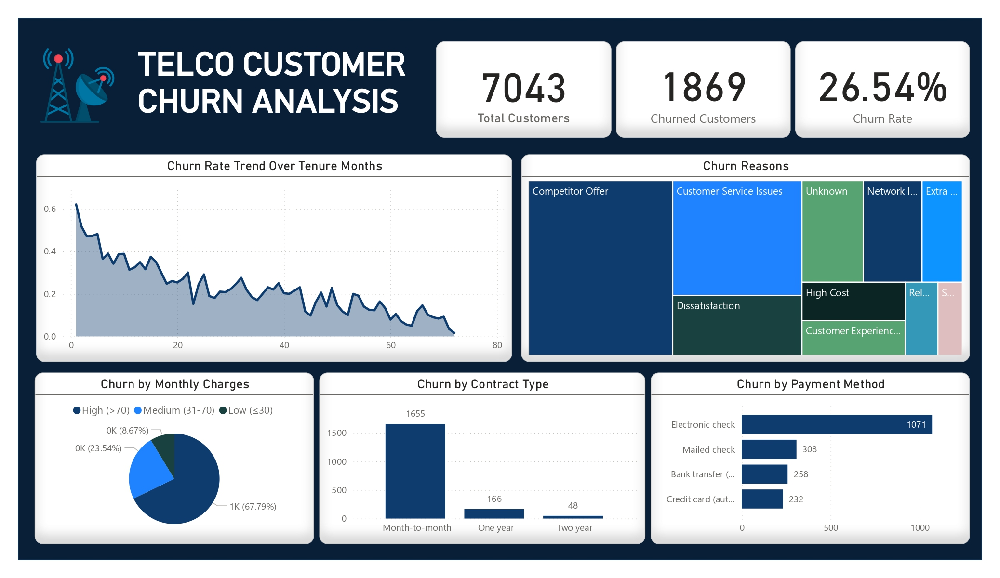

# 📊 Telco Customer Churn Analysis

This project analyzes customer churn in a telecom company using **SQL & Power BI**.  
It identifies key churn drivers and provides actionable insights through data visualization.

---

## 🏆 Business Problem  

Customer churn is a major challenge for telecom companies.  
The goal is to analyze churn patterns and help the company **reduce churn** by understanding:  

✔️ Who is churning the most?  
✔️ What factors contribute to churn?  
✔️ How does tenure affect churn?  
✔️ What services or contracts lead to higher churn? 

---

## 📂 Dataset Overview  

The dataset contains **7,043 customers** with **33 variables**, including:  

- **Customer Demographics:** Gender, senior citizen, dependents  
- **Subscription Details:** Contract type, payment method, internet service  
- **Financial Data:** Monthly charges, total charges  
- **Churn Indicator:** `Churn Value` (1 = Churned, 0 = Retained)  
- **Churn Reason:** Why customers left (e.g., "Price too high", "Competitor had better offer")  
